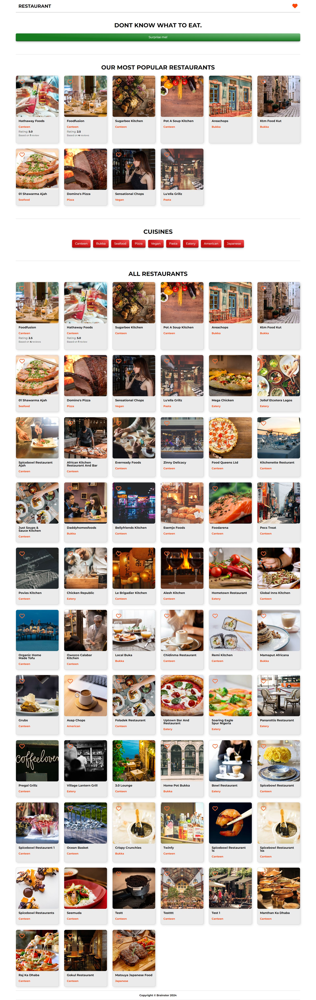

# React Restaurants Application

## About

The Restaurants Application is a React-based web application that allows users to discover and explore various restaurants. Users can view a list of restaurants, add them to their favorites for easy access, and leave reviews to share their experiences with others. This project demonstrates the use of React for creating a dynamic single page application with user-friendly interface for browsing and interacting with restaurant information. This project is part of the weekly challenges from [Brainster](https://brainster.co/ "Brainster") Front-End Academy.

## Features

- Header
- Homepage - Artist list
  - Features a list of popular and all restaurants
- RestaurantDetails
  - Detailed restaurant page with description, list reviews and leave a review section
- Favorites
  - A page that lists all the RestaurantCard components that are
    marked as favorite
- CuisineDetail
  - The detail page for each cuisine that filters all the restaurants
    based on the restaurant type

## Screenshot



## Tech Stack

- **[REACT ](https://react.dev/ "React")**
- **[ SASS](https://sass-lang.com/ "SASS")**

## Run Locally

Clone the project

```bash
  git clone https://git.brainster.co/Vlatko.Jakimoski-FE15/brainsterchallenges_vlatkojakimoski_fe15.git
```

Go to the project directory

```bash
  cd my-project
```

Install dependencies

```bash
  npm install
```

Start the app locally

```bash
  npm run start

  npm start server
```

Build

```bash
  npm run build
```

## Main App

## Routes using React Router

```javascript
 {
    path: "/",
    element: <RootLayout />,
    errorElement: <ErrorPage />,
    children: [
      { index: true, element: <Home /> },
      {
        path: "restaurant-details/:id",
        element: <RestaurantDetails />,
      },
      { path: "cuisine/:id", element: <CuisineDetail /> },
      { path: "favorites", element: <Favorites /> },
    ],
  }
```

## Global State - Redux

### Store

```javascript
const store = configureStore({
  reducer: {
    favorites: favoritesSlice.reducer,
    restaurants: restaurantsSlice.reducer,
  },
});

// Store and Dispatch types
export type AppDispatch = typeof store.dispatch;
export type RootState = ReturnType<typeof store.getState>;

export default store;
```

### Favorites Slice

```javascript
const favoritesSlice = createSlice({
  name: "favorite",
  initialState: {
    favorites: (JSON.parse(localStorage.getItem("favorites") || `""`) ||
      []) as TRestaurant[],
  },
  reducers: {
    toggleFavorite(state, actions: PayloadAction<TRestaurant>) {
      const stateItems = [...state.favorites];
      const existingItem = stateItems.find(
        (item) => item.id === actions.payload.id
      );

      if (existingItem) {
        state.favorites = stateItems.filter(
          (item) => item.id !== existingItem.id
        );

        localStorage.setItem("favorites", JSON.stringify(state.favorites));
      } else {
        state.favorites = [...stateItems, actions.payload];
        localStorage.setItem("favorites", JSON.stringify(state.favorites));
      }
    },
  },
});

```

### Restaurants Slice

```javascript
export const fetchRestaurants = () => {
  return async (dispatch: any) => {
    const fetchData = async () => {
      const response = await fetch("http://localhost:5001/restaurants");

      const data = response.json();

      return data;
    };
    try {
      const restaurants = await fetchData();
      dispatch(restaurantsActions.updateRestaurants(restaurants));
    } catch (error) {
      console.log(error);
    }
  };
};

const restaurantsSlice = createSlice({
  name: "restaurants",
  initialState: {
    restaurants: [] as TRestaurant[],
  },
  reducers: {
    updateRestaurants(state, actions) {
      state.restaurants = actions.payload;
    },
  },
});


```

## Custom Hook

```javascript
import { useEffect, useState } from "react";
import { useSelector } from "react-redux";
import { RootState } from "../store/store";
import { TRestaurant } from "../types/types";

const useRestaurantData = () => {
  const [popularRestaurants, setPopularRestaurants] = useState<TRestaurant[]>(
    []
  );
  const [randomRestaurant, setRandomRestaurant] = useState<TRestaurant>();
  // Get all restaurants from state
  const restaurants: TRestaurant[] = useSelector(
    (state: RootState) => state.restaurants.restaurants
  );

  // Get all favorite restaurants from state
  const favoriteRestaurants = useSelector(
    (state: RootState) => state.favorites.favorites
  );

  // Set popular restaurants
  useEffect(() => {
    const restaurantsWithAvgRatings = restaurants.map((restaurant) => ({
      ...restaurant,
      averageRating:
        restaurant.reviewsList.reduce((acc, item) => acc + item.stars, 0) /
          restaurant.reviewsList.length || 0,
    }));

    const popular: TRestaurant[] = restaurantsWithAvgRatings
      .sort((a, b) => b.averageRating - a.averageRating)
      .slice(0, 10);

    setPopularRestaurants(popular);
  }, [restaurants]);

  // Get random restaurant
  useEffect(() => {
    const randomIndex = Math.floor(Math.random() * restaurants.length);
    setRandomRestaurant(restaurants[randomIndex]);
  }, [restaurants]);

  return {
    popularRestaurants,
    randomRestaurant,
    restaurants,
    favoriteRestaurants,
  };
};

export default useRestaurantData;

```

## Pages

### Home Page

The home page contains 4 main components, random restaurant, list of popular, cuisines and all restaurants.

```javascript
export default function Home() {
  const dispatch: AppDispatch = useDispatch();

  useEffect(() => {
    dispatch(fetchRestaurants());
  }, [dispatch]);

  return (
    <>
      <SurpriseRestaurant />
      <PopularRestaurants />
      <Cuisines />
      <AllRestaurants />
    </>
  );
}
```

### RestaurantDetails

RestaurantDetails is detailed restaurant page with description, list reviews and leave a review section. On this page the current restaurant is fetched and displayed. The reviews are rendered with **RestaurantRatings** component. The form has handler function with basic input data check and is responsible for updating the reviews. If the data is correct we create a new review object and send a PUT request to update the current restaurant.

```javascript
<section className="details-section">
  {item ? (
    <>
      <h1 className="restaurant-details__title">{item.businessname}</h1>
      <div className="restaurant-details">
        
        <div className="restaurant-details__info">
          {item?.reviews > 0 ? <RestaurantRatings {...item} /> : null}
          <p>{item.phone}</p>
          <p>{item.email}</p>
          <p>{item.address}</p>
          <p>
            {item.parkinglot
              ? "We have a parking lot waiting for you."
              : "We dont have a parking lot."}
          </p>
        </div>
      </div>
    </>
  ) : null}
  {item && itemReviews.length > 0 ? <ReviewsSection {...item} /> : null}
  <form onSubmit={submitHandler} className="form">
    <h2 className="form__title">Review Form</h2>
    <div className="form__row">
      <label htmlFor="name">Name</label>
      <input
        type="text"
        id="name"
        name="author"
        onChange={(e) => onInputChangeHandler("author", e.target.value)}
        value={newReview.author}
      />
      {nameErr && <p className="form__error">Please fill this field!</p>}
    </div>
    <div className="form__row">
      <label htmlFor="comment">Comment</label>
      <input
        type="text"
        id="comment"
        name="comment"
        onChange={(e) => onInputChangeHandler("comment", e.target.value)}
        value={newReview.comment}
      />
      {commentErr && <p className="form__error">Please fill this field!</p>}
    </div>
    <div className="form__row">
      <label htmlFor="stars">Stars</label>
      <input
        type="range"
        id="stars"
        min={1}
        step={1}
        max={5}
        name="stars"
        onChange={(e) => onInputChangeHandler("stars", +e.target.value)}
        value={newReview.stars}
      />
    </div>
    <button className="btn btn--surprise">Submit</button>
  </form>
</section>
```

### Favorites

A page that lists all the **RestaurantCard** components that are
marked as favorite

```javascript
<section className="favorite-section">
  {restaurants && restaurants.length > 0 ? (
    <>
      <h1>Your favorite restaurants</h1>
      {restaurants.map((item) => (
        <RestaurantCard key={item.id} {...item} />
      ))}
    </>
  ) : (
    <>
      <h2>You dont have favorite restaurants</h2>
      <Link className="btn btn--cuisine" to={"/"}>
        Explore restaurants
      </Link>
    </>
  )}
</section>
```

### CuisineDetail

The detail page for each cuisine that filters all the restaurants based on the restaurant type. The restaurants are rendered with **RestaurantCard** component.

```javascript
export default function CuisineDetail() {
  const cuisine = useParams();
  const { restaurants } = useRestaurantData();

  // Filter restaurants on current chosen cuisine
  const cuisineRestaurants = restaurants.filter(
    (item) => item.restauranttype === cuisine.id
  );

  return (
    <Section title={cuisine.id || ""}>
      {cuisineRestaurants &&
        cuisineRestaurants.map((item) => (
          <Fragment key={item.id}>
            <RestaurantCard {...item} />
          </Fragment>
        ))}
    </Section>
  );
}
```

## Main Components

### Navbar Component

- The Navbar Component contains one Navlink that leads to the home page and one to Favorites restaurants.

```javascript
export default function Navbar() {
  return (
    <header className="header">
      <NavLink className={"header-logo"} to={"/"}>
        Restaurant
      </NavLink>
      <NavLink className={"header-favorites"} to={"favorites"}>
        <FontAwesomeIcon className="favorite-btn__icon" icon={HeartSolid} />
      </NavLink>
    </header>
  );
}
```

### RestaurantCard

- This component is responsible for displaying single restaurant on multiple parent components. Besides rendering the restaurant it is responsible for updating the is favorite restaurant status.

```javascript
<div className="restaurant-card">
  <button className="favorite-btn" onClick={updateRestaurants}>
    <FontAwesomeIcon
      className="favorite-btn__icon"
      icon={isFavorite ? HeartSolid : HeartRegular}
    />
  </button>
  <Link
    className="restaurant-card__wrapper"
    to={`/restaurant-details/${restaurant.slug}`}
    state={{ id: restaurant.id }}
  >
    <div className="restaurant-card__image">
      
    </div>
    <div className="restaurant-card__details">
      <h3 className="restaurant-card__title">{restaurant.businessname}</h3>
      <p className="restaurant-card__type">{restaurant.restauranttype}</p>
      {restaurant.reviews > 0 ? <RestaurantRatings {...restaurant} /> : null}
    </div>
  </Link>
</div>
```

### PopularRestaurants

- This component displays list of popular restaurants with the help of **RestaurantCard** component. It has a sorting logic where the first shown restaurant is the one with most stars combined of all users reviews.

```javascript
export default function PopularRestaurants() {
  const { popularRestaurants } = useRestaurantData();

  return (
    <Section title="Our most Popular Restaurants">
      {popularRestaurants &&
        popularRestaurants.map((item: TRestaurant) => (
          <Fragment key={item.id}>
            <RestaurantCard {...item} />
          </Fragment>
        ))}
    </Section>
  );
}
```

### Section Component

- This component holds the most components, it receives the Title of the section and its children components. Its main purpose is for global styling.

```javascript
export type TSection = {
  title: string,
  children: React.ReactNode,
};

export default function Section({ title, children }: TSection) {
  return (
    <section className="section">
      <h2 className="section__title">{title}</h2>
      <div className="section__wrapper">{children}</div>
    </section>
  );
}
```

### Cuisines Component

- This component is for creating buttons with links to CuisineDetail page respectfully, from the restaurants data and they are shown on the home page.

```javascript
export default function CuisineDetail() {
  const cuisine = useParams();
  const { restaurants } = useRestaurantData();

  // Filter restaurants on current chosen cuisine
  const cuisineRestaurants = restaurants.filter(
    (item) => item.restauranttype === cuisine.id
  );

  return (
    <Section title={cuisine.id || ""}>
      {cuisineRestaurants &&
        cuisineRestaurants.map((item) => (
          <Fragment key={item.id}>
            <RestaurantCard {...item} />
          </Fragment>
        ))}
    </Section>
  );
}
```

## Types

```javascript
type TReview = {
  id: number,
  author: string,
  comment: string,
  stars: number,
};
```

```javascript
type TRestaurant = {
  reviews: number,
  parkinglot: boolean,
  phone: string,
  image: string,
  restauranttype: string,
  businessname: string,
  address: string,
  slug: string,
  email: string,
  id: string,
  reviewsList: TReview[],
};
```
